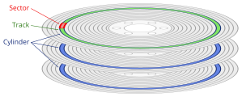
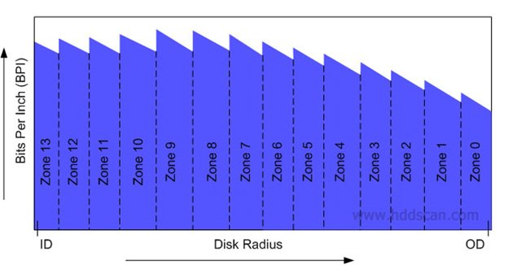

# Apresentaçao
## Objetivo
###
Iremos **desnudar** o HDD e depois **perverte-lo**.

## whoami
### Formacao
- Eng. Eletricista Enfase Computação
- Mestrado Telecomunicações

### Historico
- TK2000, PC-XT, PC-286
- BBS (lado negro da forca)
- Placas Eletrônicas
- Impressora Fiscal (AM186ED + VHDL)
- SBC ARM com IXP42x
- Portar Linux
- SBC x86 (GeodeGX/LX + BIOS)

# HDD - Visao Geral
## Hierarquia de memória	
::: columns
:::: {.column width=60%}
- Volátil / Não-Volátil
- Custo por byte
- Tempo de acesso
	- wait states
	- processo
	- nuvem
- Registrador, L1, L2, L3
- RAM, SSD, HDD, (fita, nuvem, etc)
- Acesso aleatório / Sequencial

::::
:::: {.column widht=40%}
{height=50%}
::::
:::


	
## História
- 1957 com IBM 350
- 1980 transição para 'PC'
- ATA
- SATA

## Componentes (Alto Nível)
### 
- Conectores
- PCB
- HDA (HD Assembly)
- Firmware
- OS/Driver
- Partições
- Filesystems


# HDD - Organização Física
## Conectores
::: columns
:::: {.column width=60%}

- Alimentação
	- hot plug; Vss ("negativo") primeiro
- SATA
	- Diferencial, ruído de modo comum
	- Alta velocidade
	- Rx/Tx pairs
- Selecao
	- Console Serial
::::
:::: {.column widht=40%}
{height=50%}
::::
:::

## PCB #1
::: columns
:::: {.column width=60%}
- PCB
- MCU
	- DSP
	- Loops de controle
	- (matlabshell)
	- Fabricaçao e testes
	- Decodificação do RLL + ECC
	- Interfaceamento Host (SATA)
	- DMA
	- Gerenciamento de cache
	- Controle spindle (core 8051)
- Flash
	- Firmware 1/2
::::
:::: {.column widht=40%}
{height=50%}
::::
:::

## PCB #2
::: columns
:::: {.column width=60%}
- Memória RAM
	- RAM de execução
	- Cache disco
- VCM (voice coil & spindle)
- Conector spindle
- Conector HSA
	- (head stack assembly)
- Shock sensor
- Elétrico:
	- TVS, Crowbar
	- Par diferencial
	- Resistores R Sensing
::::
:::: {.column widht=40%}
{height=50%}
::::
:::

## PCB #3
{height=100%}

## HDA - Visão exterior
::: columns
:::: {.column width=60%}
- Breath Hole
	- Não é vácuo: cabeças aerodinâmicas
	- Problema de abrir: contaminação
- Contatos das cabeças
- Contato motor spindle
::::
:::: {.column widht=40%}
{height=50%}
::::
:::
			
## HDA - Primeiro contato
::: columns
:::: {.column width=60%}
- Platters
- HSA
- Filter
- Dumpers
	- Ruído Acústico
	- Fluxo de Ar
::::
:::: {.column widht=40%}
{height=50%}
::::
:::

## HDA - HSA
::: columns
:::: {.column width=60%}
- Cabeças alinhadas
- Controle em Malha Fechada
- Variações de Fabricação
	- Codificacao
	- Adaptatives
::::
:::: {.column widht=40%}
{height=50%}
::::
:::	

## HDA - HGA
::: columns
:::: {.column width=60%}
- "Sliders"
	- (head gimbal assembly)
- Altura de voo 5 nm
- Fio de cabelo 25.000 nm
- Design aerodinamico
- Pre-amplificador
	- Sinal Fraco
	- Alta frequência (rpm / dpi)
::::
:::: {.column widht=40%}
{height=50%}
::::
:::	

## HDA - Cabeca
{height=100%}

# HDD - Organização Lógica
## Endereçamento
::: columns
:::: {.column width=60%}
- Cilindro, Cabeça, Setor (CHS)
- LBA
	- Logical Block Addressing
::::
:::: {.column widht=40%}
{height=50%}
::::
:::	
		
## Distribuição no disco
::: columns
:::: {.column width=60%}
- Velocidade angular constante
- Controlo:
	- Angulo 
	- Instante da leitura
- Problema caso setores = constante:
	- Área em função do raio
::::
:::: {.column widht=40%}
{height=100%}
::::
:::	

## Zone bit recording 1
{height=100%}

## Zone bit recording 2
{height=100%}
	
## Implicações
- Quanto mais rápido (externo):
	- Maior a Frequencia
	- Maior BER

## Posicionamento
::: columns
:::: {.column width=60%}
- Não é circunferência perfeita
- Track
- AGC, Sync (Grey Code)
- Dados com RLL
- ECC
::::
:::: {.column widht=40%}
{height=100%}
::::
:::		

## Tamanho Setor
| **Tamanho** | **Nome** |
|:---------|:---------:|
| 512      | 512       |
| 4096     | 4096      |
| 512      | 512e      |
- 512 bytes
- 4096 bytes (~+10%)
- 512e - emulado
		
# HDD - Firmware
## Localização
- Flash SPI
- Arquivos na System Area (platters)
	- LBA SA   (0....xxx)
	- LBA User (0....xxx)

## Extração - FLASH #1
- IC Flash SPI (25Q40BW)
- Protocolo SPI
- Controlador dedicado x bitbang
- Boot ROM
	
## Extração - FLASH #2
- Leitor de memória
- 1,8V ou 3,3V
- flashrom.org
- Arquivo de 512kB
- tar.bz2 firmware
	
## Extração - Atualizacao
- Pacote de atualização
- 2.6.33.3.tcSeaKernel
- tinycore
- STECon
- tar.bz2 filesystem completo
		
## Estrutura #1
- Internet
- Tabela tipo, tamanho, endereco RAM
- Compressão CPRS
- Tabela de Parâmetros

## Estrutura #2
- Comparacao entre 3 HDDs
- Extracao
- Enderecos load
- tar.bz2 abertos

## Analise estatica
- Estrutura modular
- Modulos -> Nomes
	- usados em scripts
- Endereco RAM execucao
- Modulos Flash, Modulos SA
- Carga dos overlays
- Carregar overlay livremente
	- Testado copy/modify um overlay

# HDD - Hacking
## Primeiros passos
- Habilitacao terminal
- PeekMemoryByte, +[AddrHi],[AddrLo],[Opts]
- PokeMemoryByte, =[AddrHi],[AddrLo],[Data],[Opts]
- Copia firmware descomprimido
- Mapa de memoria
- Diversas travadas/resets
	- Perda de um HDD

## Hello World #1
- $ arm-none-eabi-gcc -v
	- gcc version 8.3.1 20190703 (release)
- Poke inicio em 0x0001.04E9
- Script para carga

## Hello World #2
```
#include "uart_16550.h"
int main()  {
	uart_puts("Hi!\n");
	while (1);
}
```

## Hello World #3
### linker
```
OUTPUT_FORMAT("elf32-littlearm", "elf32-littlearm", "elf32-littlearm")
OUTPUT_ARCH(arm)
ENTRY(_entry)
SECTIONS
{
    _entry = .;
    .text         : { *(.init) *(.text) }
    .data         : { *(.data) }
    .bss          : { *(.bss) }
}
```
## Hello World #4
- Script hdd_upload.py

## GDB Stub
- GDB remote serial protocolo (RSP)
- baseado em:
	- mborgeson/gdbstub
	- arm_v7 gdb-stub.c
- stdlib
	- memset, memcpy, strlen, strcpy
- getc/putc
	- UART 16550 @ **0x400D.3000**
- mem_readb/writeb
- start:
	- hook IVT
	- disable icache/prefetch
	
## GDB Stub Seagate
- (dois meses depois...)
- [43%] Built target gdbstub.bin
- 57K gdbstub:         ELF LSB executable, ARM, EABI5, statically linked
- 5K  gdbstub.bin:     data

## Leitura LBA SA
- Extração - Parte SYSTEM AREA
- Decodificação OVERLAYS
- Presenca de ARQUIVOS
- Processamento de lote para fabricacao
- Envio/Recebimento por Ymodem
```
- ReadFile, r[FileId],[VolumeNum],[CopyNum],
            [ByteOffset],[Length],[OutputFmt]
- WriteFile, w[FileId],[VolumeNum],[CopyNum],
            [ByteOffset]
```

## Leitura LBA User
- Debug limitado
	- Estrutura caches (complexa!)
	- Buffer de leitura imediata
- Rotina de **Read @ User LBA** serial

## Montando Filesystem
- Opcoes
	- Leitura direta
	- FUSE
	- **NBD**

## Linux Block Device
- nbd-kit

## NBD Server #1
- ESP8266
- Porta TCP/IP
	- de 'comandos' (23/tcp)
	- de 'debug' (24/tcp)
- Servidor NBD (10809/tcp)

## NBD Server #2
### handshake phase
```
    memcpy(init.init_passwd, "NBDMAGIC", sizeof(init.init_passwd));
    memcpy(init.cliserv_magic, "IHAVEOPT", sizeof(init.cliserv_magic));
    init.server_flags = htons(NBD_FLAG_FIXED_NEWSTYLE | NBD_FLAG_NO_ZEROES);
	NBD_OPT_EXPORT_NAME
```

## NBD Server #3
### data phase
- Storage Size
- Loop servir dados
- Magic, action (read, write, disconnect)
- Como testar?

## NBD Server #4
### static file system
```
dd if=/dev/zero of=img bs=1K count=1026
fdisk img 
kpartx -v -a img 
mkfs.ntfs /dev/mapper/loop0p1 
mkdir /mnt/loop && mount -o loop /dev/mapper/loop0p1 /mnt/loop
echo hello_from_hell > /mnt/loop/flag.txt
umount /mnt/loop
kpartk -v -d img
xxd -i img > img.c
```

## NBD Server #5
```
nbd-client -b 512 192.168.15.84 10809 /dev/nbd1
```
- transfer_data:
	- Linux 4K/request
	- 8 operacoes de 512 bytes

## NBD Server #6
```
/* TDB */
uint8_t HDD_write_sectors(unsigned char *buffer,
 size_t first_sector, size_t sectors_in_buffer);

uint8_t HDD_read_sectors(unsigned char *buffer,
 size_t first_sector, size_t len);
```

# Futuro
## Objetivos
- Hijack do firmware
- Atualizacao remota
	- VSC
	- hdparm
	- sealin
- Infeccao persistente
	- impedir novos updates
	- forjar versao
- Area escondida
	- para arquivos via g-list
	- para arquivos na SA
- SSDs

## Agradecimento
- Obrigado
- Perguntas?

